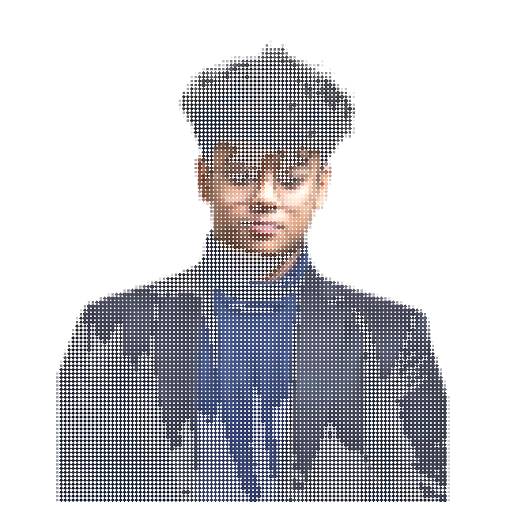
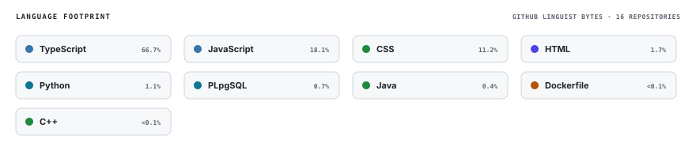
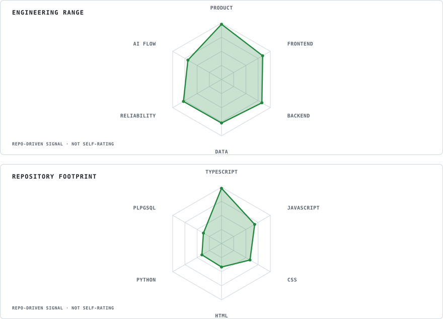
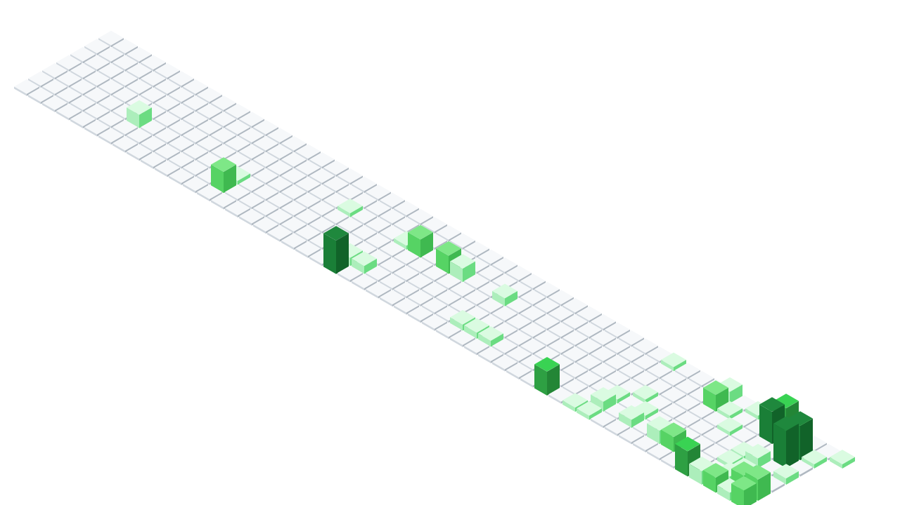
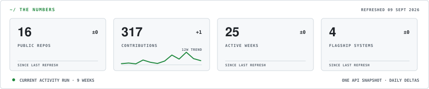
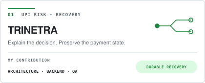
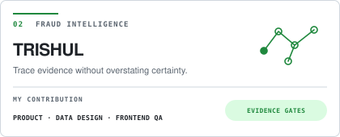
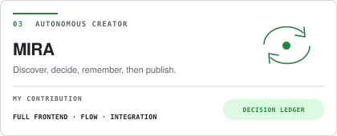
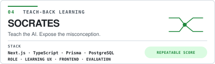

<div align="center">

<picture>
  <source type="image/svg+xml" srcset="./assets/hero/portrait-reveal.svg">
  
</picture>

<br>


<br>

<a href="https://github.com/kavya-jain14?tab=repositories"></a>
<a href="https://leetcode.com/u/Kavya_Jain_14/"></a>
<a href="https://codeforces.com/profile/kavya_jain"></a>
<a href="https://www.codechef.com/users/kavya_jain_14"></a>

</div>

---

## `~/` whoami

```console
$ cat about.txt
```

Hi, I'm **Kavya Jain**. I build systems for decisions that become difficult when evidence is incomplete, providers fail, or the happy path stops being honest.

- Currently building **TRISHUL**, a financial cyber-fraud intelligence system.
- Strongest lane: product architecture, frontend QA, backend reliability and explainable state.
- Learning track: DSA in C++ and production-grade full-stack systems.
- I treat failure recovery as a product feature, not a cleanup task.

---

## `~/` toolbox

<picture>
  <source media="(prefers-color-scheme: dark)" srcset="./assets/toolbox-dark.svg">
  <source media="(prefers-color-scheme: light)" srcset="./assets/toolbox-light.svg">
  
</picture>

---

## `~/` skill radar

<picture>
  <source media="(prefers-color-scheme: dark)" srcset="./assets/skill-radar-dark.svg">
  <source media="(prefers-color-scheme: light)" srcset="./assets/skill-radar-light.svg">
  
</picture>

<sub>Relative working range, not proficiency percentages.</sub>

---

## `~/` contribution calendar

<picture>
  <source media="(prefers-color-scheme: dark)" srcset="./assets/generated/calendar-3d-dark.svg">
  <source media="(prefers-color-scheme: light)" srcset="./assets/generated/calendar-3d-light.svg">
  
</picture>

<picture>
  <source media="(prefers-color-scheme: dark)" srcset="./assets/generated/snake-dark.svg">
  <source media="(prefers-color-scheme: light)" srcset="./assets/generated/snake-light.svg">
  
</picture>

---

## `~/` the numbers

<picture>
  <source media="(prefers-color-scheme: dark)" srcset="./assets/numbers-dark.svg">
  <source media="(prefers-color-scheme: light)" srcset="./assets/numbers-light.svg">
  
</picture>

---

## `~/` selected work

<table>
<tr>
<td width="50%">
  <a href="https://github.com/kavya-jain14/TRINETRA">
    <picture>
      <source media="(prefers-color-scheme: dark)" srcset="./assets/projects/trinetra-dark.svg">
      <source media="(prefers-color-scheme: light)" srcset="./assets/projects/trinetra-light.svg">
      
    </picture>
  </a>
</td>
<td width="50%">
  <a href="https://github.com/kavya-jain14/TRISHUL">
    <picture>
      <source media="(prefers-color-scheme: dark)" srcset="./assets/projects/trishul-dark.svg">
      <source media="(prefers-color-scheme: light)" srcset="./assets/projects/trishul-light.svg">
      
    </picture>
  </a>
</td>
</tr>
<tr>
<td width="50%">
  <a href="https://github.com/kavya-jain14/MIRA">
    <picture>
      <source media="(prefers-color-scheme: dark)" srcset="./assets/projects/mira-dark.svg">
      <source media="(prefers-color-scheme: light)" srcset="./assets/projects/mira-light.svg">
      
    </picture>
  </a>
</td>
<td width="50%">
  <a href="https://github.com/gargibhardwaj24/Socrates">
    <picture>
      <source media="(prefers-color-scheme: dark)" srcset="./assets/projects/socrates-dark.svg">
      <source media="(prefers-color-scheme: light)" srcset="./assets/projects/socrates-light.svg">
      
    </picture>
  </a>
</td>
</tr>
</table>

| Project | Problem lane | Engineering proof | My contribution |
| --- | --- | --- | --- |
| [TRINETRA](https://github.com/kavya-jain14/TRINETRA) | UPI risk and recovery | Durable payment state and explainable recovery | Architecture, backend, QA |
| [TRISHUL](https://github.com/kavya-jain14/TRISHUL) | Financial cyber-fraud intelligence | Evidence gates and traceable decisions | Product architecture, data design, frontend QA |
| [MIRA](https://github.com/kavya-jain14/MIRA) | Autonomous publishing | Source gates and a visible decision ledger | Full frontend, product flow, backend integration |
| [Socrates](https://github.com/gargibhardwaj24/Socrates) | Teach-back learning | Curated misconceptions and repeatable evaluation | Learning UX, frontend, evaluation flow |
| [CounselFlow](https://github.com/kavya-jain14/COUNSEL-FLOW) | College preference decisions | Constraint conflicts before list lock | Product architecture and decision UX |
| [PaperTrade](https://github.com/kavya-jain14/PAPER_TRADE) | Market simulation | Server-authoritative execution and portfolio state | Full-stack product engineering |

---

<div align="center">

### `~/` build something difficult

Open to software engineering internships and ambitious product collaborations.

[GitHub](https://github.com/kavya-jain14) · [Repositories](https://github.com/kavya-jain14?tab=repositories) · [LeetCode](https://leetcode.com/u/Kavya_Jain_14/) · [Codeforces](https://codeforces.com/profile/kavya_jain)

</div>
