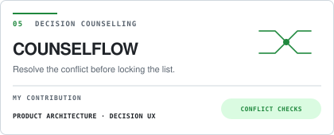
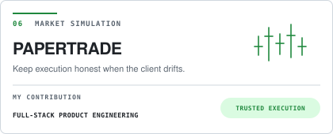

<!-- GENERATED:STATUS:START -->

<a href="https://github.com/kavya-jain14/TRISHUL/commit/55b09c321af0f7ee163b134f4b44f695cf7211ec" title="Latest default-branch activity across 6 selected repositories; all authors. 0 commits in the last 7 days through 2026-09-11T08:08:06.901Z."><code>$ open to software engineering internships · latest work: TRISHUL</code></a>

<!-- GENERATED:STATUS:END -->

<picture>
  <source type="image/svg+xml" srcset="./assets/hero/portrait-reveal.svg">
  
</picture>

<h1>Kavya Jain</h1>

<code>systems engineering · product architecture · evidence-first software</code>

<strong>B.Tech CSE @ ABES Engineering College</strong> Building reliable product systems and solving DSA in C++.

---

## `~/` selected work

<!-- GENERATED:PROJECTS:START -->

  <a href="https://github.com/kavya-jain14/TRINETRA">
    <picture>
      <source media="(prefers-color-scheme: dark)" srcset="./assets/projects/trinetra-dark.svg">
      <source media="(prefers-color-scheme: light)" srcset="./assets/projects/trinetra-light.svg">
      
    </picture>
  </a>

  <a href="https://github.com/kavya-jain14/TRISHUL">
    <picture>
      <source media="(prefers-color-scheme: dark)" srcset="./assets/projects/trishul-dark.svg">
      <source media="(prefers-color-scheme: light)" srcset="./assets/projects/trishul-light.svg">
      
    </picture>
  </a>

  <a href="https://github.com/kavya-jain14/MIRA">
    <picture>
      <source media="(prefers-color-scheme: dark)" srcset="./assets/projects/mira-dark.svg">
      <source media="(prefers-color-scheme: light)" srcset="./assets/projects/mira-light.svg">
      
    </picture>
  </a>

  <a href="https://github.com/gargibhardwaj24/Socrates">
    <picture>
      <source media="(prefers-color-scheme: dark)" srcset="./assets/projects/socrates-dark.svg">
      <source media="(prefers-color-scheme: light)" srcset="./assets/projects/socrates-light.svg">
      
    </picture>
  </a>

  <a href="https://github.com/kavya-jain14/COUNSEL-FLOW">
    <picture>
      <source media="(prefers-color-scheme: dark)" srcset="./assets/projects/counselflow-dark.svg">
      <source media="(prefers-color-scheme: light)" srcset="./assets/projects/counselflow-light.svg">
      
    </picture>
  </a>

  <a href="https://github.com/kavya-jain14/PAPER_TRADE">
    <picture>
      <source media="(prefers-color-scheme: dark)" srcset="./assets/projects/papertrade-dark.svg">
      <source media="(prefers-color-scheme: light)" srcset="./assets/projects/papertrade-light.svg">
      
    </picture>
  </a>

### Evidence chains

<strong>01 · TRINETRA</strong> · accepted timeout → one replay-safe recovery path

<strong>Problem</strong> A provider can accept a payment and time out before confirmation. A blind retry risks a duplicate submission, while the payer and operator still need one explainable history.

<strong>Constraint</strong> Replay safety, provider recovery and ordered risk evidence must survive across API replicas without turning a pending state into a retry instruction.

<strong>Decision</strong> Keep payment and provider-attempt history in a tenant-scoped ledger, reuse the original idempotent resource on replay, then resolve uncertainty through status inquiry.

<strong>Result</strong> The synthetic accepted-timeout checkpoint and PostgreSQL/Redis integration test exercise one provider submission, cross-replica replay and recovery to the original payment.

<strong>Stack</strong> <code>TypeScript · Fastify · PostgreSQL · Redis · React</code>

<strong>My contribution</strong> ARCHITECTURE · BACKEND · QA

<strong>Proof</strong>

<ul>
<li><a href="https://github.com/kavya-jain14/TRINETRA#third-integration-checkpoint">Accepted-timeout recovery checkpoint</a></li>
<li><a href="https://github.com/kavya-jain14/TRINETRA/blob/main/apps/api/test/postgres-redis.integration.test.ts">PostgreSQL and Redis integration test</a></li>
<li><a href="https://github.com/kavya-jain14/TRINETRA/commit/e92175890855a52a17fa604a6b79c7d128c3e4eb">Recovery checkpoint change</a></li>
</ul>

<a href="https://github.com/kavya-jain14/TRINETRA">Inspect repository →</a>

<strong>02 · TRISHUL</strong> · cash-out forecast → explicit PASS or ABSTAIN

<strong>Problem</strong> After a fraud complaint, investigators need to trace attributable exposure and assess probable cash-out behaviour without presenting incomplete signals as certainty.

<strong>Constraint</strong> Money can commingle, records arrive from authorised sources at different times, and location and time may have different levels of support.

<strong>Decision</strong> Build a provenance-backed case graph, represent exposure as a range, and gate geo and time forecasts independently so either dimension can abstain.

<strong>Result</strong> The prediction and API tests cover supported forecasts, partial evidence, stationary funds and intentional abstention without inventing candidates.

<strong>Stack</strong> <code>TypeScript · Fastify · PostgreSQL · React · Vitest</code>

<strong>My contribution</strong> PRODUCT · DATA DESIGN · FRONTEND QA

<strong>Proof</strong>

<ul>
<li><a href="https://github.com/kavya-jain14/TRISHUL/blob/main/packages/prediction/test/evidence-gate.test.ts">Evidence-gate unit tests</a></li>
<li><a href="https://github.com/kavya-jain14/TRISHUL/blob/main/apps/api/test/exit-evidence-flow.test.ts">Exit-mode and forecast API flow</a></li>
<li><a href="https://github.com/kavya-jain14/TRISHUL#product-boundary">Locked product boundary</a></li>
</ul>

<a href="https://github.com/kavya-jain14/TRISHUL">Inspect repository →</a>

<strong>03 · MIRA</strong> · autonomous publishing → threshold, memory and audit

<strong>Problem</strong> An autonomous editor can repeat stories, amplify weak sources or publish hype while hiding why a candidate was accepted or rejected.

<strong>Constraint</strong> The agent must continue after initialization, limit each cycle, survive refreshes and retain evidence for both publication and rejection.

<strong>Decision</strong> Separate discovery, editorial scoring, durable decision memory and publishing; enforce source gates, a fixed threshold and duplicate fingerprints.

<strong>Result</strong> The backend and policy tests exercise one-item pacing, rejected candidates, later backlog publication and duplicate suppression in durable memory.

<strong>Stack</strong> <code>TypeScript · Node.js · React · SQLite · Docker</code>

<strong>My contribution</strong> FRONTEND · PRODUCT FLOW · INTEGRATION

<strong>Proof</strong>

<ul>
<li><a href="https://github.com/kavya-jain14/MIRA/blob/main/apps/api/src/backend.test.ts">Autonomous runtime behaviour tests</a></li>
<li><a href="https://github.com/kavya-jain14/MIRA/blob/main/packages/agent-core/src/editorial-policy.test.ts">Editorial threshold and rejection tests</a></li>
<li><a href="https://github.com/kavya-jain14/MIRA/commit/5bea458f09d27c274d811aa6a024e1f98e89e397">Decision-ledger repair change</a></li>
</ul>

<a href="https://github.com/kavya-jain14/MIRA">Inspect repository →</a>

<strong>04 · SOCRATES</strong> · confident explanation → deterministic misconception test

<strong>Problem</strong> A learner can sound confident while missing a core misconception, so completion alone cannot show whether the concept was understood.

<strong>Constraint</strong> Evaluation must remain repeatable and explainable even when no LLM key is available.

<strong>Decision</strong> Seed known misconceptions and score the learner&apos;s correction, reasoning and evidence with a transparent stage-based rubric.

<strong>Result</strong> The rubric maps each learning stage to observable signals and returns the evidence span used by the scoring flow.

<strong>Stack</strong> <code>Next.js · TypeScript · Prisma · PostgreSQL</code>

<strong>My contribution</strong> LEARNING UX · FRONTEND · EVALUATION

<strong>Proof</strong>

<ul>
<li><a href="https://github.com/gargibhardwaj24/Socrates/blob/main/src/lib/rubric.ts">Transparent stage-based rubric</a></li>
<li><a href="https://github.com/gargibhardwaj24/Socrates/blob/main/src/components/MisconceptionFingerprint.tsx">Misconception evidence surface</a></li>
<li><a href="https://github.com/gargibhardwaj24/Socrates/commit/d01b1b6170568d0cd34960bb48c7e8249e04029e">Kavya&apos;s learning-catalogue and navigation change</a></li>
</ul>

<a href="https://github.com/gargibhardwaj24/Socrates">Inspect repository →</a> · <a href="https://socrates-one-coral.vercel.app">Open demo ↗</a>

<strong>05 · COUNSELFLOW</strong> · preference list → conflict audit before lock

<strong>Problem</strong> A candidate can receive a plausible college list that violates their branch priority, budget, distance or hard exclusions and still lock it by mistake.

<strong>Constraint</strong> Official cutoff evidence, hard constraints and soft preferences must remain distinguishable, deterministic and reviewable after every edit.

<strong>Decision</strong> Generate an ordered strategy, surface coded contradictions, mark the audit stale after edits and block lock while a critical conflict remains.

<strong>Result</strong> Domain tests exercise eight conflict rules, reproducible strategy hashes and the invariant that unresolved critical conflicts prevent lock.

<strong>Stack</strong> <code>React · TypeScript · Vite · Zod · Vitest</code>

<strong>My contribution</strong> PRODUCT ARCHITECTURE · DECISION UX

<strong>Proof</strong>

<ul>
<li><a href="https://github.com/kavya-jain14/COUNSEL-FLOW/blob/main/src/domain/conflicts.test.ts">Eight deterministic conflict rules</a></li>
<li><a href="https://github.com/kavya-jain14/COUNSEL-FLOW/blob/main/src/domain/lock.test.ts">Lock invariants</a></li>
<li><a href="https://github.com/kavya-jain14/COUNSEL-FLOW/commit/d116e83f61be8f6e85bf1ef22b794ab830d9bd6b">Attention-first counselling flow change</a></li>
</ul>

<a href="https://github.com/kavya-jain14/COUNSEL-FLOW">Inspect repository →</a>

<strong>06 · PAPERTRADE</strong> · changing market session → one authoritative execution path

<strong>Problem</strong> A trading simulator must keep orders and portfolio state credible when client prices drift, the exchange closes or the live price provider is unavailable.

<strong>Constraint</strong> The server owns execution price and holdings while the interface still needs useful market behaviour outside NSE live hours.

<strong>Decision</strong> Canonicalize symbols, resolve execution prices on the backend, persist transactions and switch between live and bounded simulated market sessions.

<strong>Result</strong> Backend tests cover NSE live boundaries, weekends, published holidays, the special Sunday session and time-bucketed simulated candles.

<strong>Stack</strong> <code>React · Express · MongoDB · SSE · Yahoo Finance</code>

<strong>My contribution</strong> FULL-STACK PRODUCT ENGINEERING

<strong>Proof</strong>

<ul>
<li><a href="https://github.com/kavya-jain14/PAPER_TRADE/blob/main/paper_trade_backend/test/marketSession.test.js">NSE market-session boundary tests</a></li>
<li><a href="https://github.com/kavya-jain14/PAPER_TRADE/blob/main/paper_trade_backend/test/marketBrain.test.js">Simulated candle time-bucket test</a></li>
<li><a href="https://github.com/kavya-jain14/PAPER_TRADE/commit/74c51023c86155ee62bbe8651e7f7599504e73ef">Terminal and authentication redesign</a></li>
</ul>

<a href="https://github.com/kavya-jain14/PAPER_TRADE">Inspect repository →</a> · <a href="https://paper-trade-phi.vercel.app">Open demo ↗</a>

<!-- GENERATED:PROJECTS:END -->
---

## `~/` whoami

<!-- GENERATED:ABOUT:START -->
<picture>
  <source media="(max-width: 600px) and (prefers-color-scheme: dark)" srcset="./assets/generated/about-terminal-dark-compact.svg">
  <source media="(max-width: 600px)" srcset="./assets/generated/about-terminal-light-compact.svg">
  <source media="(prefers-color-scheme: dark)" srcset="./assets/generated/about-terminal-dark.svg">
  
</picture>
<a href="./data/about.txt">Read about.txt</a>
<!-- GENERATED:ABOUT:END -->
---

## `~/` toolbox

<!-- GENERATED:TOOLBOX:START -->

  
  
  
  
  
  
  
  
  

Detected from GitHub Linguist bytes across 16 public repositories. Hover any badge for its live share and byte count.
<!-- GENERATED:TOOLBOX:END -->
---

## `~/` skill radar

<picture>
  <source media="(max-width: 600px) and (prefers-color-scheme: dark)" srcset="./assets/skill-radar-dark-compact.svg">
  <source media="(max-width: 600px)" srcset="./assets/skill-radar-light-compact.svg">
  <source media="(prefers-color-scheme: dark)" srcset="./assets/skill-radar-dark.svg">
  <source media="(prefers-color-scheme: light)" srcset="./assets/skill-radar-light.svg">
  
</picture>

Relative working range, not proficiency percentages. Engineering range is project-driven; repository footprint reports the six largest GitHub Linguist byte totals. Current practice: TypeScript systems and DSA in C++.

---

## `~/` activity trail

<picture>
  <source media="(prefers-color-scheme: dark)" srcset="./assets/generated/rabbit-calendar-dark.svg">
  <source media="(prefers-color-scheme: light)" srcset="./assets/generated/rabbit-calendar-light.svg">
  
</picture>
---

### `~/` build the difficult thing

Open to software engineering internships and collaborations on systems with difficult state, incomplete evidence, or failure paths worth designing properly.

