<picture>
  <source type="image/webp" srcset="./assets/portrait-reveal.webp">
  
</picture>

# Kavya Jain

### I build decision systems for the moments where software cannot afford to guess.

Full-stack engineering · explainable AI · reliable state · product systems

[Selected systems](#selected-systems) · [Activity](#activity-in-three-views) · [Working set](#working-set) · [LeetCode](https://leetcode.com/u/Kavya_Jain_14/) · [Codeforces](https://codeforces.com/profile/kavya_jain)

---

I like software most when the answer is not obvious: a payment looks risky, a college preference conflicts with a real constraint, or an autonomous system has to decide whether it has enough evidence to act.

That is the thread through my work—**turning uncertain decisions into explicit state, understandable reasoning and a recovery path.**

## Four systems I can defend end-to-end

<table>
<tr>
<td width="50%">
  <a href="https://github.com/kavya-jain14/TRINETRA">
    <picture>
      <source media="(prefers-color-scheme: dark)" srcset="./assets/projects/trinetra-dark.svg">
      <source media="(prefers-color-scheme: light)" srcset="./assets/projects/trinetra-light.svg">
      
    </picture>
  </a>
</td>
<td width="50%">
  <a href="https://github.com/kavya-jain14/TRISHUL">
    <picture>
      <source media="(prefers-color-scheme: dark)" srcset="./assets/projects/trishul-dark.svg">
      <source media="(prefers-color-scheme: light)" srcset="./assets/projects/trishul-light.svg">
      
    </picture>
  </a>
</td>
</tr>
<tr>
<td width="50%">
  <a href="https://github.com/kavya-jain14/MIRA">
    <picture>
      <source media="(prefers-color-scheme: dark)" srcset="./assets/projects/mira-dark.svg">
      <source media="(prefers-color-scheme: light)" srcset="./assets/projects/mira-light.svg">
      
    </picture>
  </a>
</td>
<td width="50%">
  <a href="https://github.com/gargibhardwaj24/Socrates">
    <picture>
      <source media="(prefers-color-scheme: dark)" srcset="./assets/projects/socrates-dark.svg">
      <source media="(prefers-color-scheme: light)" srcset="./assets/projects/socrates-light.svg">
      
    </picture>
  </a>
</td>
</tr>
</table>

**TRINETRA** keeps a payment decision explainable through provider failures, retries and recovery. I worked on the system architecture, backend contracts, durable payment state and QA.

**TRISHUL** connects receiver verification, behavioural signals, complaints and transaction traces without pretending uncertain evidence is certainty. I lead the product architecture, data design and frontend QA.

**MIRA** is an autonomous creator that discovers, decides, remembers and publishes with a visible decision trail. I built the full frontend, product flow and part of the backend integration.

**Project Socrates** makes the learner teach a concept back, then checks the gaps behind a confident explanation. I worked on the learning UX, frontend and evaluation flow in collaboration with [Gargi Bhardwaj](https://github.com/gargibhardwaj24).

## Activity in three views

### 01 / Build pulse

<picture>
  <source media="(prefers-color-scheme: dark)" srcset="./assets/activity-pulse-dark.svg">
  <source media="(prefers-color-scheme: light)" srcset="./assets/activity-pulse-light.svg">
  
</picture>

A custom 52-week signal generated directly from my public GitHub contribution history and refreshed daily.

### 02 / Contribution terrain

<picture>
  <source media="(prefers-color-scheme: dark)" srcset="./assets/generated/calendar-3d-dark.svg">
  <source media="(prefers-color-scheme: light)" srcset="./assets/generated/calendar-3d-light.svg">
  
</picture>

The same activity rendered as an animated 3D calendar—solid colour, no rainbow chart or extra widget panel.

### 03 / Contribution snake

<picture>
  <source media="(prefers-color-scheme: dark)" srcset="./assets/generated/snake-dark.svg">
  <source media="(prefers-color-scheme: light)" srcset="./assets/generated/snake-light.svg">
  
</picture>

Generated in matching teal variants for light and dark GitHub themes.

## Working set

- **Systems:** Node.js, Fastify, Express, PostgreSQL, MongoDB, Redis, BullMQ
- **Product:** React, Next.js, TypeScript, accessible interaction design
- **Applied intelligence:** autonomous workflows, retrieval, deterministic scoring, evidence gates
- **Reliability:** runtime contracts, idempotency, transactional outbox, immutable histories, integration tests

## Also on the workbench

- [CounselFlow](https://github.com/kavya-jain14/COUNSEL-FLOW) turns counselling constraints into an explainable preference order and surfaces conflicts before the user locks a decision.
- [PaperTrade](https://github.com/kavya-jain14/PAPER_TRADE) is a server-authoritative market simulator for execution, portfolio state and deliberate practice without real capital.
- Competitive programming on [LeetCode](https://leetcode.com/u/Kavya_Jain_14/), [Codeforces](https://codeforces.com/profile/kavya_jain) and [CodeChef](https://www.codechef.com/users/kavya_jain_14).

---

**Open to software engineering internships and ambitious product collaborations.**

[Explore the repositories](https://github.com/kavya-jain14?tab=repositories)

