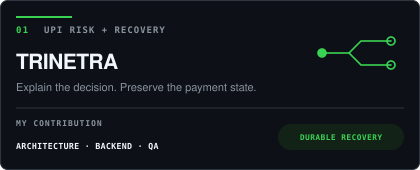
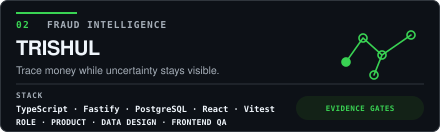
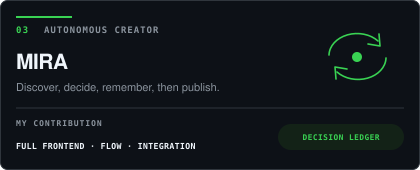
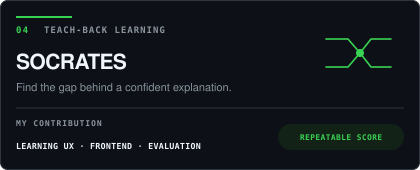

# Kavya Jain

**I design software systems that can explain their decisions.**

Full-stack engineering · explainable AI · reliability · trust and safety

[Projects](#-flagship-systems) · [Engineering range](#-engineering-range) · [LeetCode](https://leetcode.com/u/Kavya_Jain_14/) · [Codeforces](https://codeforces.com/profile/kavya_jain) · [CodeChef](https://www.codechef.com/users/kavya_jain_14)

---

## `~/` operating principle

Most demos stop at the happy path. I usually start where it breaks: incomplete evidence, provider timeouts, contradictory choices, or an AI system that cannot explain why it acted.

My work sits at that boundary: **product decisions translated into explicit contracts, durable state and testable proof.**

---

## `~/` flagship systems

<table>
<tr>
<td width="50%">
  <a href="https://github.com/kavya-jain14/TRINETRA">
    <picture>
      <source media="(prefers-color-scheme: dark)" srcset="./assets/projects/trinetra-dark.svg">
      <source media="(prefers-color-scheme: light)" srcset="./assets/projects/trinetra-light.svg">
      
    </picture>
  </a>
</td>
<td width="50%">
  <a href="https://github.com/kavya-jain14/TRISHUL">
    <picture>
      <source media="(prefers-color-scheme: dark)" srcset="./assets/projects/trishul-dark.svg">
      <source media="(prefers-color-scheme: light)" srcset="./assets/projects/trishul-light.svg">
      
    </picture>
  </a>
</td>
</tr>
<tr>
<td width="50%">
  <a href="https://github.com/kavya-jain14/MIRA">
    <picture>
      <source media="(prefers-color-scheme: dark)" srcset="./assets/projects/mira-dark.svg">
      <source media="(prefers-color-scheme: light)" srcset="./assets/projects/mira-light.svg">
      
    </picture>
  </a>
</td>
<td width="50%">
  <a href="https://github.com/gargibhardwaj24/Socrates">
    <picture>
      <source media="(prefers-color-scheme: dark)" srcset="./assets/projects/socrates-dark.svg">
      <source media="(prefers-color-scheme: light)" srcset="./assets/projects/socrates-light.svg">
      
    </picture>
  </a>
</td>
</tr>
</table>

<strong>What the cards mean in engineering terms</strong>

- **TRINETRA:** state-safe payment intents, explainable risk contracts, recovery workers and integration proof across PostgreSQL and Redis.
- **TRISHUL:** complaint-to-trace state, exposure-aware graph intelligence and evidence-gated forecasting with explicit abstention.
- **MIRA:** durable autonomous publishing with source gates, duplicate control, memory and a visible decision ledger.
- **Project Socrates:** teach-back UX, curated misconceptions and repeatable scoring instead of ungrounded conversational feedback.

---

## `~/` engineering range

| Area | Working set |
| --- | --- |
| Systems and backend | Node.js, Fastify, Express, PostgreSQL, MongoDB, Redis, BullMQ |
| Product engineering | React, Next.js, TypeScript, accessible interaction design |
| Applied intelligence | Autonomous workflows, evidence gates, deterministic scoring, retrieval |
| Reliability | Runtime contracts, idempotency, transactional outbox, immutable histories, integration tests |

---

## `~/` selected builds

[CounselFlow](https://github.com/kavya-jain14/COUNSEL-FLOW) turns counselling constraints into an explainable preference order and exposes conflicts before the user locks it.

[PaperTrade](https://github.com/kavya-jain14/PAPER_TRADE) is a server-authoritative trading simulator for market execution, portfolio state and deliberate practice without real capital.

---

**Open to ambitious engineering collaborations and software internships.**

[github.com/kavya-jain14](https://github.com/kavya-jain14)

